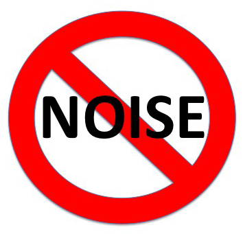
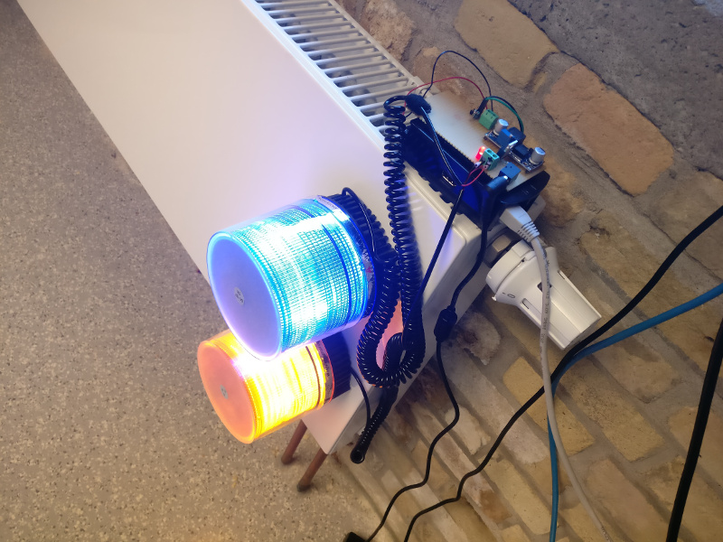

# noisybot

The so called “noisybot” is a Raspberry Pi 1 Model B+ which is running a node.js application (https://github.com/DangerTimsen/noisybot). It's code is inspired by the famous Norrisbot by @Imammino

## Installation
### Prerequisites
You need an AWS S3 bucket for your user whitelist if you want to restrict access to this feature. Create a bucket with one file in it, userwhitelist.dat with allowed slack usernames like this:
[
"peter",
"tim",
"john"
]

Create a aws.config file in the root folder with this structure for accessing your bucket:

{ "accessKeyId": "XXXXXXXXXXXXXXXXXXXXX", "secretAccessKey": "xxxxxxxxxxxxabcxxxxxxxxxabc", "region": "eu-central-1" }

## Running the NoisyBot

todo

## Getting the API token for your Slack channel

To allow the NoisyBot to connect your Slack channel you must provide him an API key. To retrieve it you need to add a new Bot in your Slack organization by visiting the following url: https://*yourorganization*.slack.com/services/new/bot, where *yourorganization* must be substituted with the name of your organization (e.g. https://*loige*.slack.com/services/new/bot). Ensure you are logged to your Slack organization in your browser and you have the admin rights to add a new bot.

You will find your API key under the field API Token, copy it in a safe place and get ready to use it.

## Configuration

The NoisyBot is configurable through environment variables. 
Create a .env file in the root folder with this structure:

BOT_API_KEY=xxxxxxxxxxxxxxxxxxxxxxxxxxxx
HARDWARETYPE=rpi or odroid

| Environment variable | Description |
|----------------------|-------------|
| `BOT_API_KEY` | this variable is mandatory and must be used to specify the API token needed by the bot to connect to your Slack organization |
| `HARDWARETYPE` | Raspberry Pi = rpi ; Odroid C3 = odroid  |

## The Making of

The Noisybot is an extension of Norrisbot. (https://github.com/lmammino/norrisbot)

## License

Licensed under [MIT License](LICENSE). © Tim Petersen.